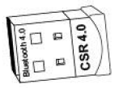
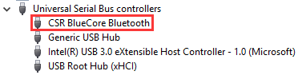
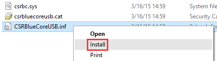

Ximmerse Drivers
============

This folder contains our drivers, currently including

- `CSR Drivers.rar`: Bluetooth USB Adapter driver. This should be installed  first in order to successfully connect tracking camera and controllers.

## How to Install
1. Plugin Bluetooth USB Adapter to PC.

 	

	
	

	> Normally, the driver will be installed automatically, which can be verified by checking whether there is a `CSR BlueCore Bluetooth` under `Device Manager -> Universal Serial Bus controllers`.
	> 

	If you can not find it there, you will need to install the driver mannually. Steps are:

1. Download the driver from [here](https://github.com/Ximmerse/SDK/blob/master/Drivers/CSR%20Drivers/CSR%20Drivers.rar?raw=true) (ZIP file).
2. Unzip the file to your PC.
3. Depending on your PC system:
	- For Win7: `CSR Drivers -> Windows 7 -> win32/64 -> CSRBlueCoreUSB.inf ->` right click `-> Install`.
	- For Win8: `CSR Drivers -> Windows 8 -> win32/64 -> CSRBlueCoreUSB.inf ->` right click `-> Install`.
	- For Win10: `CSR Drivers -> Windows 10 -> win32/64 -> CSRBlueCoreUSB.inf ->` right click `-> Install`.
		
