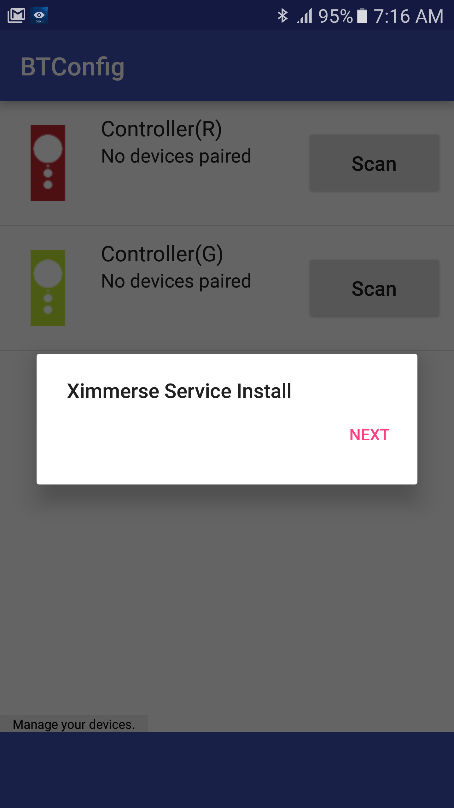
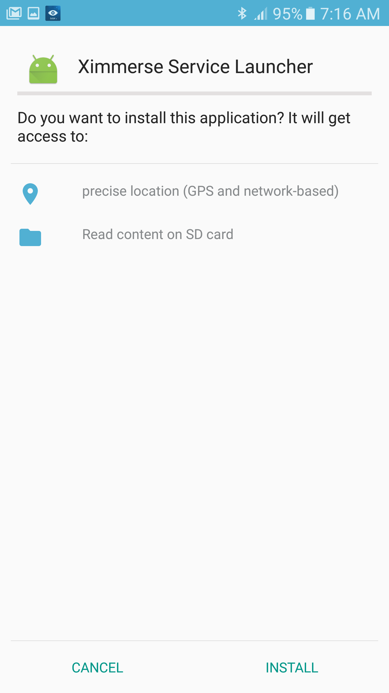
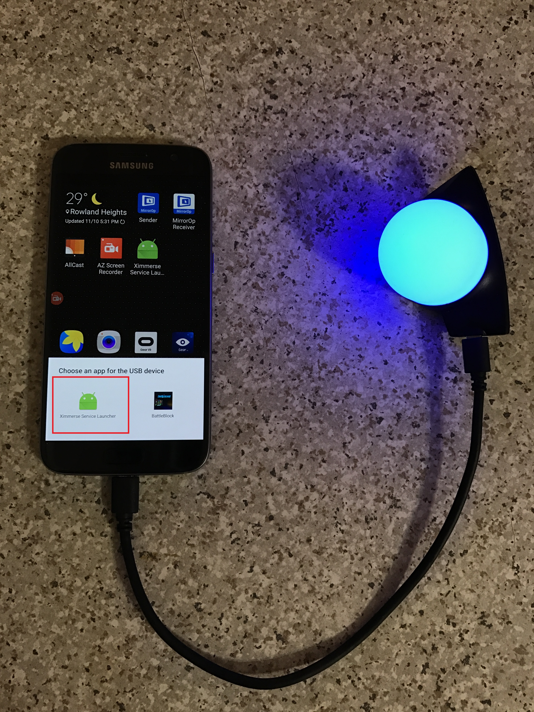
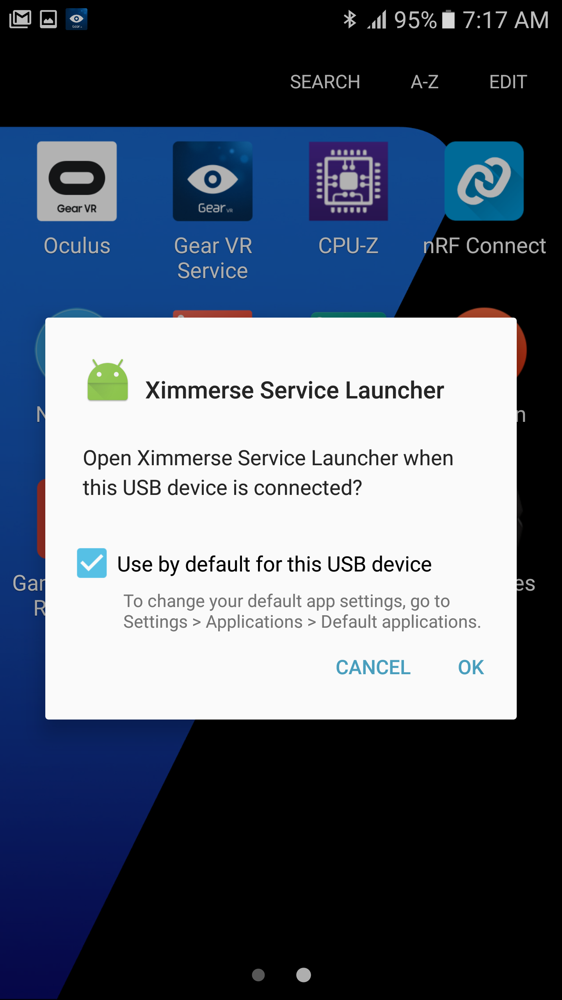
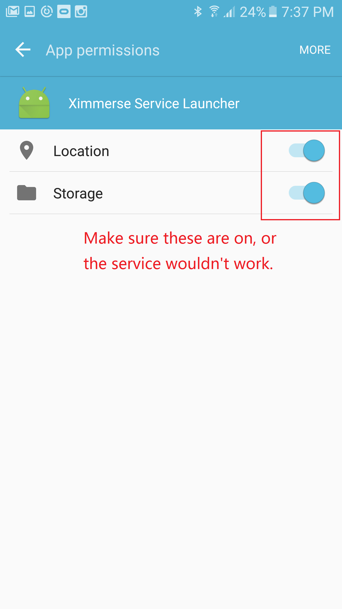

# Hardware Test
Follow these steps to ensure your DK04 devices work properly:

1. Power up tracking camera with the provided USB cable.

    >Note : The light on the camera will be flashing in red slowly when it is powered on, but not communicating to any device.

    >Note : When you mount the camera on a wall or on a tripod, it is recommended to make sure the tracking is sitting at your eye level.

    

	
    

1. Install the 2 apks on your android phone.
>1. DeviceTest.apk : This is an application that outputs controller position, rotation, button press, etc.
>1. BTConfig.apk : This is a tool that can be used to connect to selected controllers.

1. Turn on two of your controllers by holding down ``"O"`` button for about 3 seconds.
1. Once all the applications are installed, open BTConfig application.
  >Note: Once the application is running, it may ask for user to turn on Bluetooth feature. Please hit "Yes" button to make sure Bluetooth is turned on.

1. The first time when you open the BTConfig, it will prompt user to install Ximmerse Service. Please hit ``"Next"`` and then hit ``"Install"``.
    

	
    

    

	
    

1. Hook up your head tracking blob tracker to your phone through OTG wire. Select ``'"Ximmerse Service Launcher"'`` as the default application for the USB device. When you plug in the cable to your phone, it may look like either of the screenshots below. Once you have done this step, every time when you plug in the head tracking blob, it will start Ximmerse Service.

    

	
    

    

	
    

1. Go to ``"Application Manager"`` on your android phone, find ``'"Ximmerse Service Launcher"'`` and click on it. Then click on ``"Permissions"``. You only have to do this once though.

    

	
    

1. Make sure ``'"Ximmerse Service Launcher"'`` has both permissions selected.

    

	
    

1. Go to ``"BTConfig"`` if you are not in that application. Push both grip buttons. While keep both grip buttons pressed, click on ``"Scan"`` button to connect controller. When controller is connected, the LED indicator on the controller should turn blue.
    

	
    

    

	
    

	

	
    

1. While keeping the connection between tracking blob and phone, please launch the ``"Device Test"`` application that was installed earlier. Now you should be able to see data getting outputted on the screen. You can also switch UI by clicking on ``"X-Cobra"`` or ``"X-Hawk"`` button located at top left corner.
    

	
    

