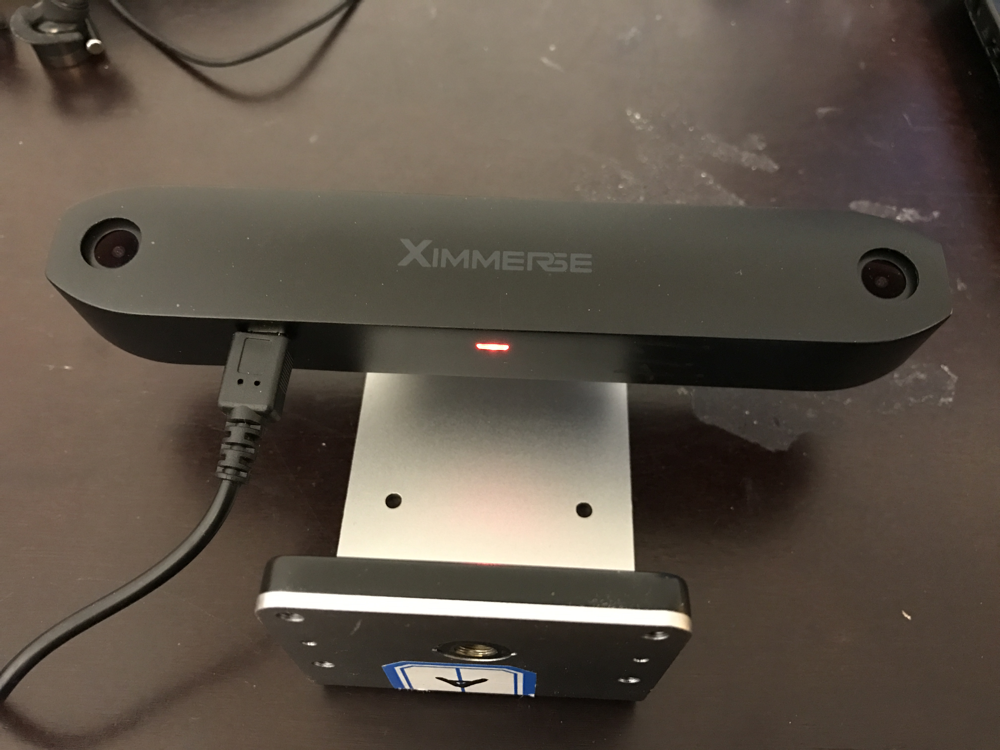
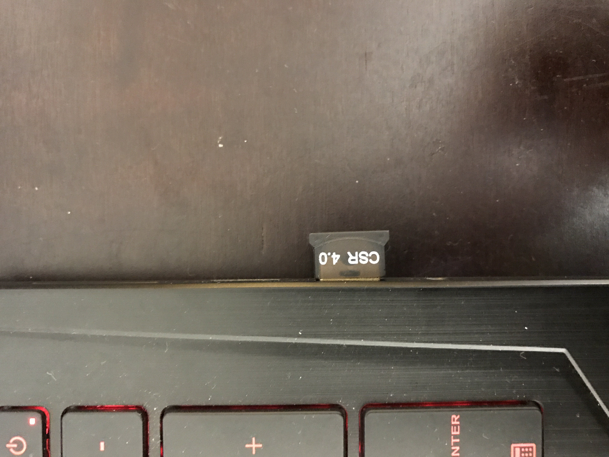
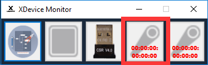
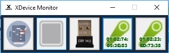

#Windows PC Setup(USB Dongle Required)

1. Power up tracking camera with the provided USB cable.
>Note : The light on bottom of the camera will be flashing once connected to a power source. When you mount the camera on a wall or on a tripod, it is recommended to make sure the tracking camera is sitting at your eye level.

    

	
    

1. Run `reg.bat` as **administrator** to setup dev environment. 
>Note: It is necessary to make sure the file path of the `reg.bat` file doesn't contain any space, or it wouldn't run successfully. For simplicity, it is recommend to unzip the folder and put the folder under C drive root folder.

1. Connect head tracking blob to one of the USB ports on your PC.
>Note : The blue light on bottom of the tracking camera should start blinking in blue at this point.

1. At this point, you will only be able to get controller position data through tracking camera. To get controller button and IMU data, please follow the guide below:

    * Make sure both controllers are turned on.

    * Plugin CSR 4.0 USB module into one of your PC USB port.
        

		
        

    * Download CSR Drivers [here](https://github.com/Ximmerse/SDK/tree/master/Drivers/CSR%20Drivers) and install the driver that is compatible to your Windows operation system.

    * Run ``"XDeviceMonitor.exe"`` executable which can be downloaded [here](https://github.com/Ximmerse/SDK/blob/master/Tools/XDeviceMonitor/XDeviceMonitor.rar?raw=true)

    * Most of the time, once ``"XDeviceMonitor.exe"`` starts, it should try to automatically search and pair your controllers. However, if this doesn't happy after a while, you can always RIGHT click on controller icon and select ``"Auto-Connect"``.
        

		
        

    * Once both controllers are connected, the LED on the controllers should turn blue, and the icons in ``"XDeviceMonitor.exe"`` application should turn green with BLE address displayed.

        

		
        

1. Your hardware is now ready to be used on your PC. If our Unity SDK is downloaded(which can be downloaded [here](https://github.com/Ximmerse/SDK/tree/master/Unity)) and imported, you can run ``"02 - Pick Cubes"`` sample scene and start moving around.