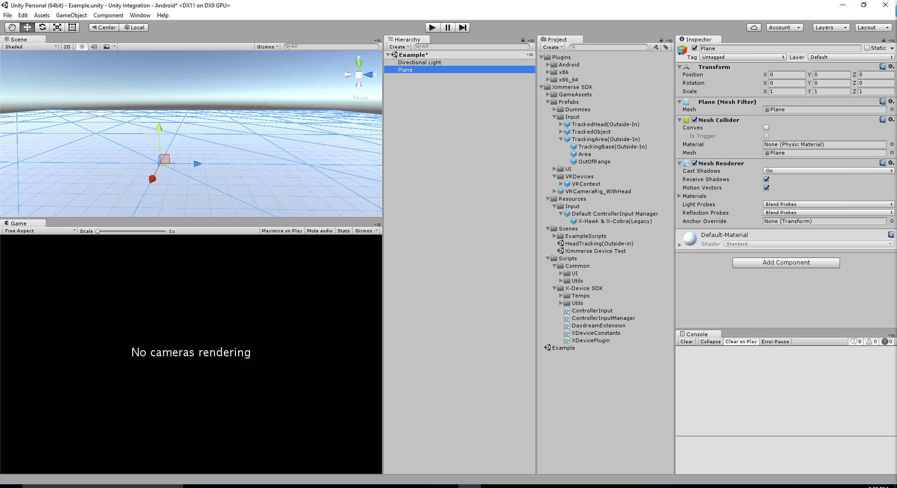
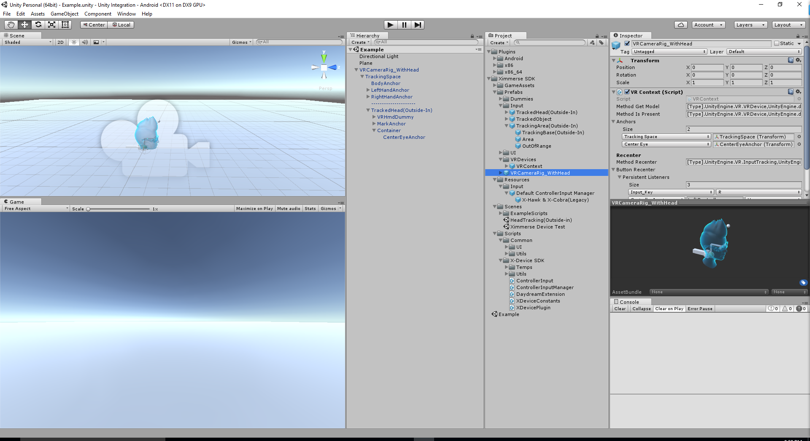
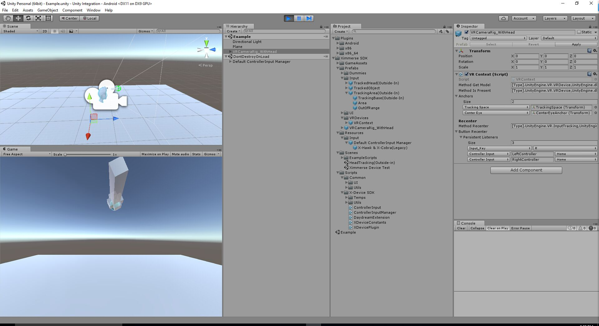
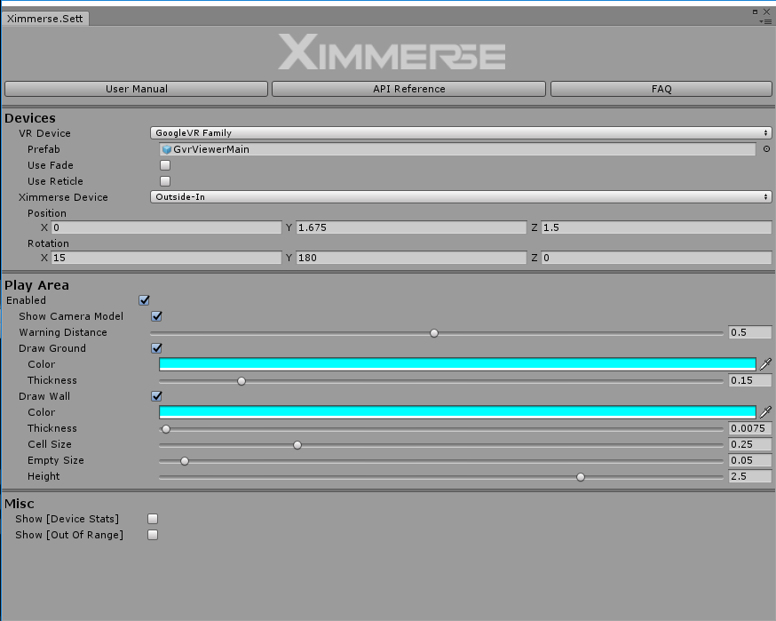
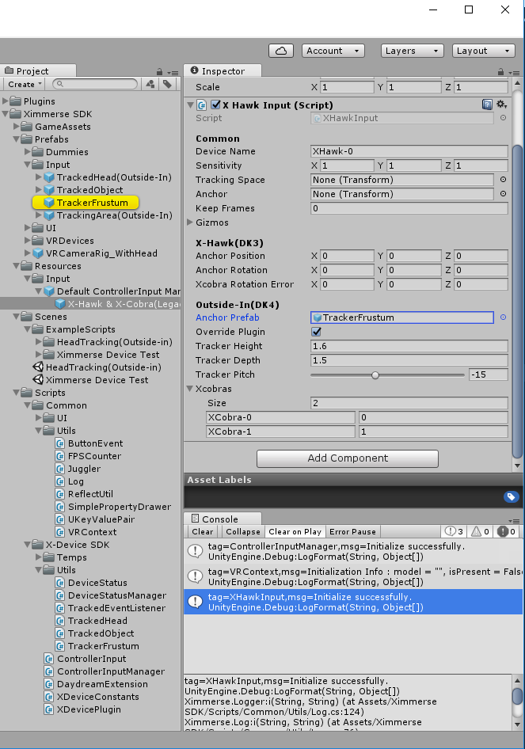
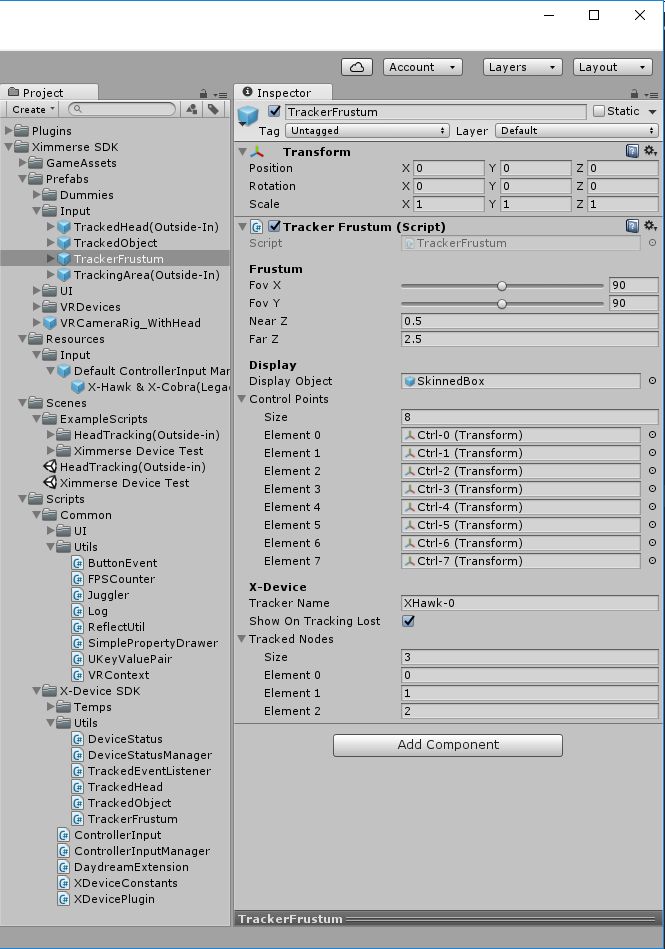

<h1>Release Notes </h1>
(It is always recommended to use the latest version SDK, as some of the older SDKs may not work with the hardware anymore)

SDK  v2.0
* New BLE connection solution. Please check out SDK website for details: https://ximmerse.github.io/SDK_Doc/hardwareguide/
* Added tracking area visual indicator. 
* Added functionality to get controller battery info.

SDK  v1.2
* Data Dispatching algorithm is greatly improved. 
* Fixed occasional tracking object not smooth in previous version of SDK.

SDK  v1.1
* Fixed xml config file issue.
* Included extensions for various headset systems and input systems, including HTV Vive, Oculus, Xbox controllers, etc. (Extensions are provided in a separate unity package.)
* Optimized tracking algorithm.

SDK v1.0
* Official SDK that supports outside-in devices.

<h1>Ximmerse SDK Integration Guide(v2.0)</h1>

### Setup from scratch
1. Import Unity SDK package to your project.
1. Create a plane where you can walk on. You can skip this step if you have an existing game environment.
	

	
    

1. Drag and drop `VRCameraRig` to the scene.
	

	
    

1. Make sure your hardware is hooked up to PC. Find how [here](https://github.com/Ximmerse/SDK/tree/master/Tools/PCSetupTools).

1. Hit **Play** button in editor.
1. Move the head tracking blobs or/and controllers in front of the camera, and you should be able to see the virtual head or/and virtual controllers moving in the scene window.
	

	
    

=======================================================

<h2>Ximmerse Settings Tool </h2>
Since SDK v2.0, a Ximmerse Settings tool is provided. 
You can access it by going **Window->Ximmerse Settings** to open up the Ximmerse Setting tool.
	

	
    

	
#### Inspector Options:
`VR Device` : Select which VR famility to support. Currently, there are 2 major families. One is Google Cardboard/Daydream, the other one GearVR/Oculus. 

`Position` : Default User Height. 

`Rotation` : 15 degrees matches the tracking camera actual angle.

Feel free to explore other options in Ximmerse Settings tool. The names of the fiels should be very self-explanary. 

==========================================================================

<h1> Prefab Description</h1>

============================================================================

<h2> VREventSystem </h2>
##### Description
This prefab is needed in the scene if you want to use provided ray caster to interact with Unity UI elements.
>Note: The prefab is already configured out of box and ready to be used.

===========================================================================

<h2> VRRaycaster</h2>
##### Description
A prefab that can be used to interact Unity UI with laser beam.

##### Inspector Options
  - `Controller` : If this is "None", it will match its parent `ControllerType`. If it can't find anything, it will default to HMD input during runtime.

===========================================================================

<h2> VRCameraRig</h2>
##### LeftHandAnchor
This is a virtual representation of the **LEFT** controller or **RED** blob controller.
###### Inspector Options:
* `Target`: If this is defined in inspector, the selected transform will be manipulated by this TrackedObject instance. If this is not defined, it will be using its own transform.
* `Source`: This field defines where the data should be coming from. Since this is Left hand controller, "Left Controller" is selected.
* `Use Position`: If this TrackedObject instance accepts Position information.
* `Use Rotation`: If this TrackedObject instance accepts Rotation information.
* `Check Parent`: If this TrackedObject instance will be placed under TrackingSpace during runtime. This is unchecked if you wish to customize prefab structure.
* `Can Recenter`: If you can reset yaw or not.

##### RightHandAnchor
This is a virtual representation of the **RIGHT** controller or **GREEN** blob controller.
###### Inspector Options:
* `Target`: If this is defined in inspector, the selected transform will be manipulated by this TrackedObject instance. If this is not defined, it will be using its own transform.
* `Source`: This field defines where the data should be coming from. Since this is Right hand controller, "Right Controller" is selected.
* `Use Position`: If this TrackedObject instance accepts Position information.
* `Use Rotation`: If this TrackedObject instance accepts Rotation information.
* `Check Parent`: If this TrackedObject instance will be placed under TrackingSpace during runtime. This is unchecked if you wish to customize prefab structure.
* `Can Recenter`: If you can reset yaw or not.

===========================================================================

<h1> Runtime Generated Objects</h1>
If you look closely, there are a few objects getting created every time the game runs.

<h2> Default ControllerInput Manager</h2>
Default ControllerInput Manager prefab is a configuration prefab.
	

	
    

===========================================================================

<h2>TrackerFrustum</h2>
TrackerFrustum is a virtual representation of recommended interaction area. This prefab will be instantiated during runtime and get renamed as **"TrackerAnchor(X-Hawk DK4)"**
If any of the devices(head blob, left controller, and right controller) is out of recommended interaction area, the grid wall will show up.
	

	
    

##### Key Inspector Settings
- `Fov X`: Horizontal FOV of the device.
- `Fov Y`: Vertical FOV of the device.
- `Tracked Nodes`: Defines what defines to track when it is out of recommended interaction area. 0 stands for left controller. 1 stands for right controller. 2 stands for head tracking blob.

===========================================================================

<h2>_PlayArea</h2>
_PlayArea and all the children attached to it are generated during runtime. It is not a prefab. 

===========================================================================

<h2>HeadAnchor(Outside-In)</h2>
This prefab is instantiated during runtime, and is renamed as "HeadAnchor".
CenterEyeAnchor is attached to this HeadAnchor during runtime. 

===========================================================================

<h2>GvrViewerMain</h2>
This prefab is required when developing on Cardboard/Daydream system. 
Once Google Daydream unity is imported, this prefab will automaticly find required script from Daydream unity plugin.

===========================================================================

<h2>PlayerPrefsEx-Default</h2>
PlayerPrefsEx-Default is prefab that contains all the settings related to Ximmerse Setting tool. 

===========================================================================

